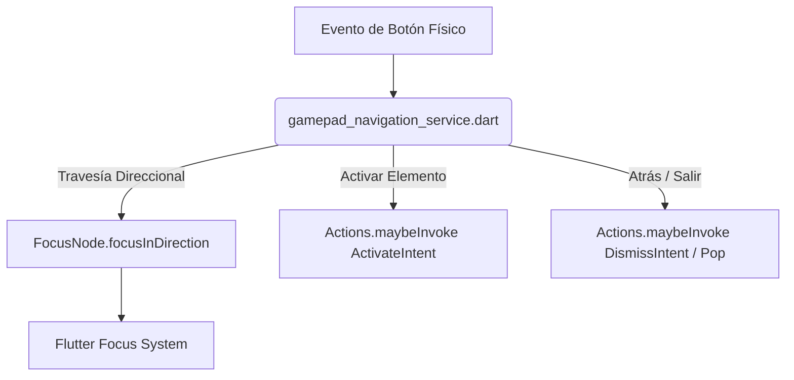
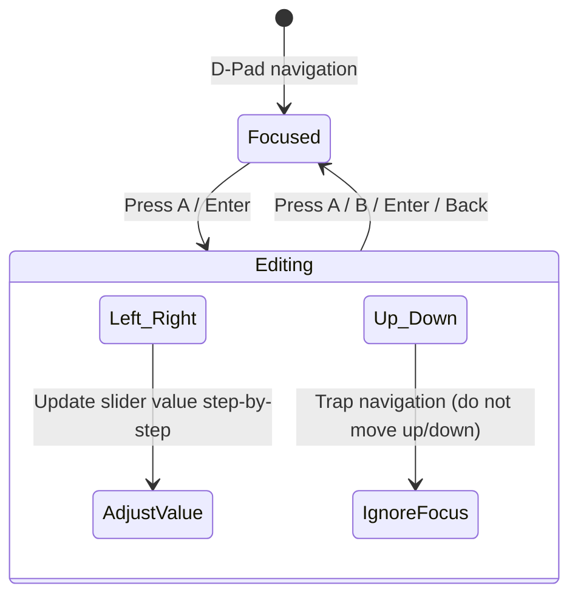

# Guía del Sistema de Navegación por Mando y Gestión de Foco en JUJO Stream

Esta documentación detalla los patrones de diseño, componentes y lógica utilizados en **JUJO Stream** (`StreamClient`) para ofrecer una experiencia premium de navegación con mando (Gamepad-First), adaptada para televisores (TV) y dispositivos portátiles.

---

## 1. Retroalimentación Visual (Visual Feedback)

El sistema visual responde dinámicamente al foco del mando para emular la interfaz de una consola moderna. Se implementa mediante las siguientes técnicas:

### A. Escala y Elevación (Scaling & Translation)
Los elementos enfocados aumentan ligeramente de tamaño y se desplazan hacia arriba para dar una sensación de profundidad.
* **Escala en Tarjetas (`_CarouselCard`):** Cambia su escala de `0.94` (inactivo) a `1.0` (activo/enfocado) con `AnimatedScale` en un intervalo de 160ms.
* **Escala General (`TvFocusable`):** Aplica un escalado tridimensional `Matrix4.diagonal3Values(1.06, 1.06, 1.06)` usando un `AnimatedContainer` de 150ms.
* **Elevación en Y:** Los botones enfocados (`_FocusableActionBtn` y `_presetButton`) aplican una traslación hacia arriba (`-2px` o `-10px` en tarjetas) mediante `Matrix4.translationValues(0, -Y, 0)`.

### B. Bordes y Contornos Activos
* Se dibuja un borde de color de acento activo (`accent` o `accentLight` de la paleta del tema) cuando el elemento está enfocado.
* En `TvFocusable`, el borde cambia de `transparent` y ancho `0` a color activo con ancho `3`.
* En botones e inputs de configuración, el borde aumenta de `1.0` a `1.4` o `1.5` de grosor, aumentando la intensidad del color.

### C. Sombras Dinámicas (Box Shadow Offset)
* El foco altera las sombras (`BoxShadow`) del contenedor aumentando la opacidad, la dispersión (`blurRadius` de `10` a `20`) y el desplazamiento vertical (`offset` de `Offset(0, 4)` a `Offset(0, 10)`).
* Esto acentúa el efecto de flotación o elevación física sobre la interfaz.

### D. Secuencia de Pulsación (Pulse Animation)
* Cuando una tarjeta se selecciona activamente en el carrusel, se ejecuta una animación de "pulso" mediante un `ScaleTransition` con `TweenSequence`:
  ```dart
  TweenSequence<double>([
    TweenSequenceItem(tween: Tween(begin: 1.0, end: 1.07), weight: 40),
    TweenSequenceItem(tween: Tween(begin: 1.07, end: 0.98), weight: 30),
    TweenSequenceItem(tween: Tween(begin: 0.98, end: 1.0), weight: 30),
  ])
  ```
  Esto proporciona una respuesta táctil visual muy pulida al cambiar de selección.

### E. Efectos de Sonido del Sistema (`UiSoundService`)
La navegación visual se complementa con sonidos rápidos cargados en la caché de audio del sistema:
* **`playUiMove()`**: Se reproduce en cada cambio de foco o desplazamiento del cursor.
* **`playClick()`**: Feedback sonoro de pulsación rápida (WAV generado en PCM por software).
* **`playFavorite()`**: Acorde de doble tono sintetizado al marcar un juego como favorito.
* **`playServerEnter()` / `playClickToInit()`**: Sonidos ambientales en transiciones principales.

---

## 2. Movimiento y Navegación con Mando (Spatial Navigation)

El movimiento en la aplicación se basa en dos pilares: el sistema de navegación por eventos nativos del sistema y el sistema de travesía espacial de Flutter.



### A. Intercepción y Travesía Direccional (`GamepadNavigationService`)
* Escucha los eventos globales del MethodChannel del mando y los mapea directamente al gestor de foco de Flutter:
  - `up` / `down` / `left` / `right` $\rightarrow$ `focus.focusInDirection(TraversalDirection)`
  - `select` $\rightarrow$ `Actions.maybeInvoke(context, const ActivateIntent())` (ejecuta la acción del widget enfocado).
  - `back` $\rightarrow$ Intenta invocar `DismissIntent()` y si no hay manejadores, ejecuta `Navigator.maybePop(context)`.

### B. Sincronización Dinámica de Nodos de Foco
* En listados dinámicos (como la grilla o el carrusel), los `FocusNode` se gestionan en un mapa (`_cardFocusNodes`).
* `_syncFocusNodes` elimina y libera (`dispose()`) los nodos obsoletos que corresponden a juegos filtrados, e inserta nuevos nodos sobre los elementos visibles para evitar fugas de memoria o saltos de foco a elementos invisibles.

### C. Centrado Automático de Elementos (`Scrollable.ensureVisible`)
* Al recibir el foco, cada widget personalizado (`_FocusableActionBtn`, `_FocusableSliderRow`, etc.) ejecuta:
  ```dart
  Scrollable.ensureVisible(
    context,
    alignment: 0.5, // Centra el elemento verticalmente en el viewport
    duration: const Duration(milliseconds: 250),
    curve: Curves.easeOutCubic,
  );
  ```
* En el carrusel horizontal, `_centerOnIndex` calcula la compensación exacta considerando el ancho de la tarjeta, el espaciado y el ancho del viewport para desplazar la lista de manera fluida mediante `animateTo`.

### D. Control del Foco en Pestañas (Tab Controller Logic)
* En la pantalla de Configuración (`SettingsScreen`), los bumpers laterales (`L1`/`R1`) cambian de pestaña.
* Para evitar que el foco se pierda o permanezca en la pestaña anterior, el listener del tabulador realiza el siguiente flujo:
  1. Desenfoca el elemento actual: `scope.focusedChild?.unfocus()`.
  2. En la siguiente llamada al frame (`addPostFrameCallback`), busca el primer hijo interactivo de la nueva pestaña:
     ```dart
     final first = scope.traversalDescendants
         .where((n) => n.canRequestFocus && !n.skipTraversal)
         .firstOrNull;
     first?.requestFocus();
     ```

---

## 3. Captura y Manejo Correcto del Foco (Focus Trapping & Recovery)

Para evitar que el usuario quede atrapado en bucles infinitos o pierda la selección del mando, se aplican las siguientes directivas:

### A. Autofoco Inicial (Autofocus Placement)
* Las pantallas principales y diálogos definen un elemento de entrada clave con `autofocus: true`.
* Al cargar la pantalla de juegos, `_screenFocusNode.requestFocus()` se dispara en el primer frame para asegurar que el mando responda de inmediato sin requerir un toque táctil previo.

### B. Aislamiento en Modales y Cuadros de Diálogo
* Los modales se envuelven en un widget `Focus` principal que intercepta las teclas del mando:
  - Captura el botón `B` / `gameButtonB` para cerrar el diálogo (`Navigator.pop`).
  - El resto de los elementos en el fondo se deshabilitan o ignoran mediante la propiedad `skipTraversal: true` en los FocusNodes correspondientes.

### C. Comportamiento en Campos de Texto (Keyboard Input Trapping)
* Mientras un campo de texto está activo (`isEditable` en `GamepadNavigationService`):
  - Las flechas izquierda/derecha se ignoran en el motor de navegación para permitir mover el cursor dentro del texto.
  - Las flechas arriba/abajo permiten salir del input hacia otros elementos interactivos de la interfaz.
  - El botón `back` (B) desenfoca el input y oculta el teclado en pantalla (`TextInput.hide`).

---

## 4. Índices y Travesía Dinámica de Grillas

Navegar con mando en interfaces bidimensionales requiere un cálculo de índices exacto:

### A. Desplazamiento en Grillas Dinámicas
* Cuando el usuario pulsa Flecha Abajo o Flecha Arriba en modo grilla, la selección no debe moverse al siguiente índice lineal de la lista ($i \pm 1$), sino al elemento en la fila inferior/superior.
* Esto se calcula determinando dinámicamente el número de columnas (`crossAxisCount`) de acuerdo al ancho actual de la pantalla:
  ```dart
  final cols = _gridCrossAxisCount();
  _moveSelection(apps, cols);  // Para mover abajo
  _moveSelection(apps, -cols); // Para mover arriba
  ```
* El desplazamiento de la grilla (`_scrollGridToIndex`) calcula la altura aproximada de las filas para centrar el elemento enfocado.

---

## 5. Mapeo Completo de Botones del Mando (Gamepad Mapping)

La siguiente tabla resume el funcionamiento de cada botón del mando y su comportamiento global:

| Botón (Xbox / PS) | Acción en Panel de Juegos (AppView) | Acción en Ficha de Detalle (AppDetails) | Comportamiento del Widget de Configuración (Settings/Slider) |
| :--- | :--- | :--- | :--- |
| **A / Cross (Ⓐ)** | Abre la ficha de detalles o ejecuta el juego seleccionado. | Ejecuta/Reanuda la transmisión del juego. | Confirma la selección / Activa el modo edición (en Sliders). |
| **B / Circle (Ⓑ)** | Cierra la vista actual / Pop del navegador. | Cierra la vista actual de detalles. | Sale del modo edición (Sliders) / Cierra diálogos. |
| **X / Square (Ⓧ)** | Alterna entre vista de grilla y carrusel. | Ejecuta directamente la transmisión del juego. | Acciona directamente la casilla seleccionada. |
| **Y / Triangle (Ⓨ)** | Abre la ficha de detalles directamente. | Cierra la sesión activa en el PC (si está ejecutándose). | N/A |
| **LB / L1** | N/A | Restablece los ajustes personalizados de este juego. | Cambia a la pestaña de la izquierda en Configuración. |
| **RB / R1** | Agrega o elimina el juego de favoritos. | Agrega o elimina el juego de favoritos. | Cambia a la pestaña de la derecha en Configuración. |
| **LT / L2** | Filtra por la categoría anterior. | Abre el menú para añadir el juego a una Colección. | N/A |
| **RT / R2** | Filtra por la siguiente categoría. | Guarda/Aplica los ajustes modificados del perfil. | N/A |
| **START / Options** | Inicia el juego directamente (o apaga el juego si está activo). | N/A | N/A |
| **SELECT / Share** | Abre la pantalla de Ajustes de Presentación. | N/A | N/A |
| **LS Click / L3** | Abre el buscador global. | N/A | N/A |
| **RS Click / R3** | Abre el panel de Filtros Inteligentes por Géneros. | N/A | N/A |
| **D-Pad / Analog** | Navega la selección (arriba, abajo, izquierda, derecha). | Navega el foco entre las opciones de la ficha. | **Modo normal:** Mueve foco.<br>**Modo edición:** Izquierda/Derecha ajusta valor; Arriba/Abajo bloquea salida de foco. |

### Visualización del flujo de Ajuste de Sliders con Mando:


---

## 6. Recomendaciones para Nuevos Componentes (Best Practices)

1. **Evitar Focus Loss:** Todo nuevo botón, diálogo o campo de entrada debe tener un nodo de foco definido y participar del traversal grupal.
2. **Usar `TvFocusable`:** Para componentes interactivos en pantalla, envolver el hijo en `TvFocusable` para heredar automáticamente la escala de escala de tamaño `1.06`, los bordes dinámicos y la respuesta de eventos `A` y `B`.
3. **Mapear en `GamepadNavigationService`:** Cualquier botón o atajo de gamepad global de hardware debe registrarse o interceptarse en el manejador central para mantener uniformidad en la travesía.
